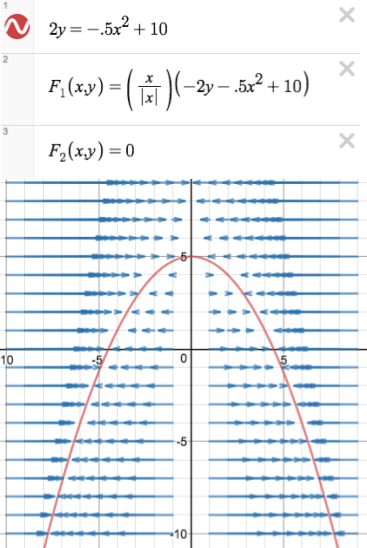
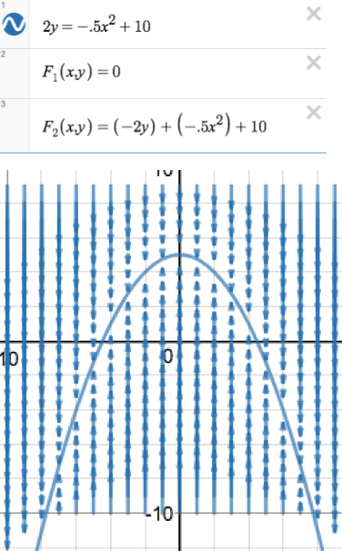
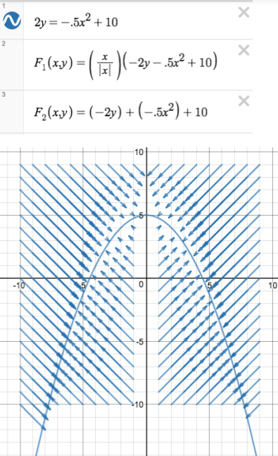
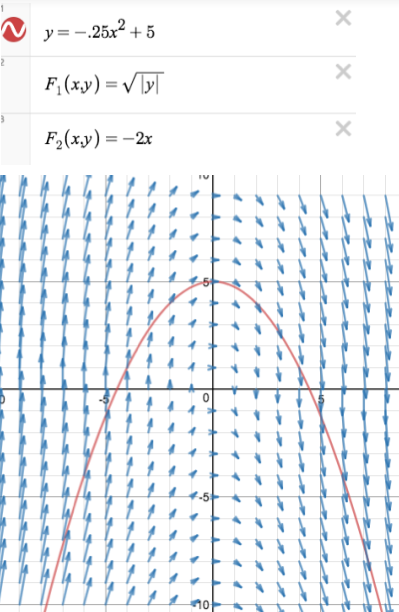
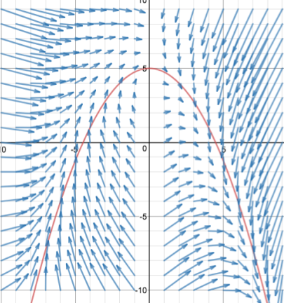
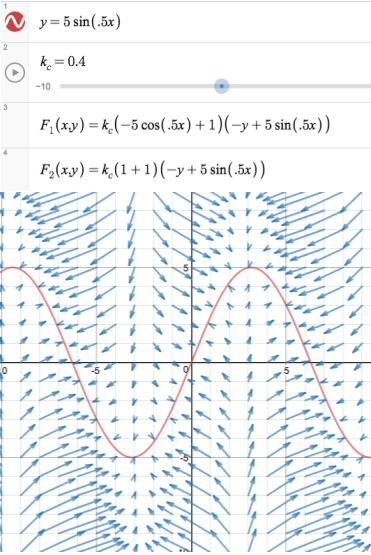
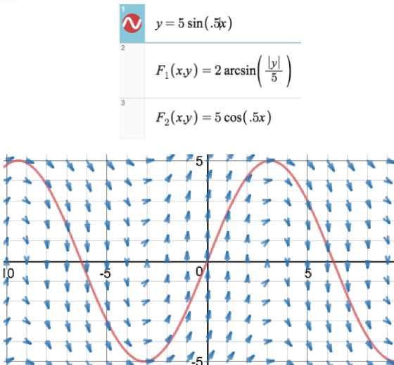
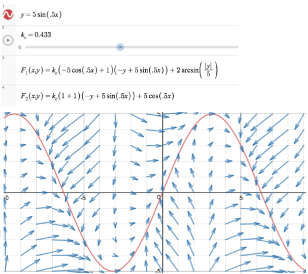

# Vector Field Motion Profiling
➡ An original take on motion profiling, by overlaying vector fields.  

## Original Work

### X Correction

### Y Correction

### XY Correction

### Path Correction (x^2)

### Combined Correction

## Improved Work

Now uses derivative as a coefficient for more advanced correction

### XY Correction 

### Path Correction 

### XY Correction 

